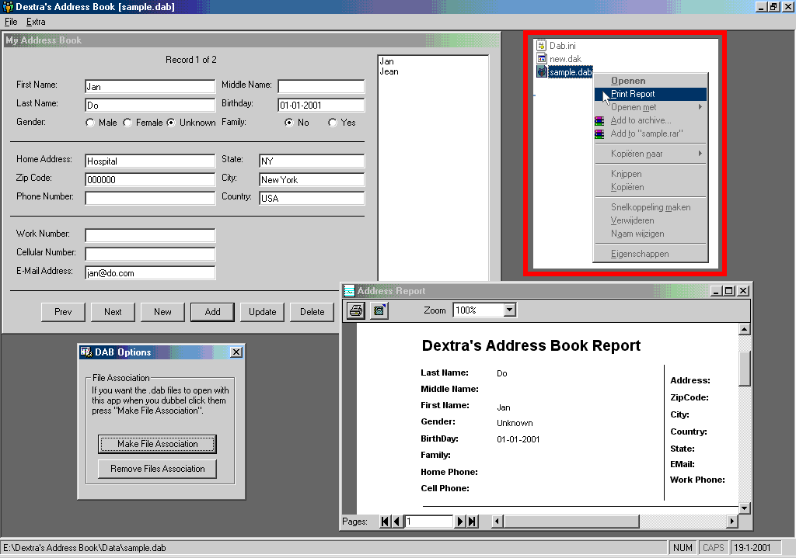



## Dextra's Address Book \[DAB\]

### Description

Well This is my First App and my First Submit to PSC. Please take a look.

I wanted to make an DataBase. To start simpel i made an Address book. I know there are a lot if this books here. But this one is diferent :).

It has the function with Last File Opend, File Asosiation, (with open and print function) printing an DataReport and some other stuff.

Im just an beginner with VB6. So comments and stuff are welcome. if ya wana Vote do so if not do not :).

Greetz Black-Dextra
 
### More Info
 
paramenters are:

/new : to open my app and make an new file.

/open <filename> : to open the file

/print <filename> : to print the DataReport.

             |
---                |---
**Submitted On**   |2001-01-21 11:22:22
**By**             |[Black\-Dex](https://github.com/Planet-Source-Code/PSCIndex/blob/master/ByAuthor/black-dex.md)
**Level**          |Beginner
**User Rating**    |4.8 (29 globes from 6 users)
**Compatibility**  |VB 6\.0
**Category**       |[Databases/ Data Access/ DAO/ ADO](https://github.com/Planet-Source-Code/PSCIndex/blob/master/ByCategory/databases-data-access-dao-ado__1-6.md)
**World**          |[Visual Basic](https://github.com/Planet-Source-Code/PSCIndex/blob/master/ByWorld/visual-basic.md)
**Archive File**   |[CODE\_UPLOAD140051212001\.zip](https://github.com/Planet-Source-Code/black-dex-dextra-s-address-book-dab__1-14534/archive/master.zip)

